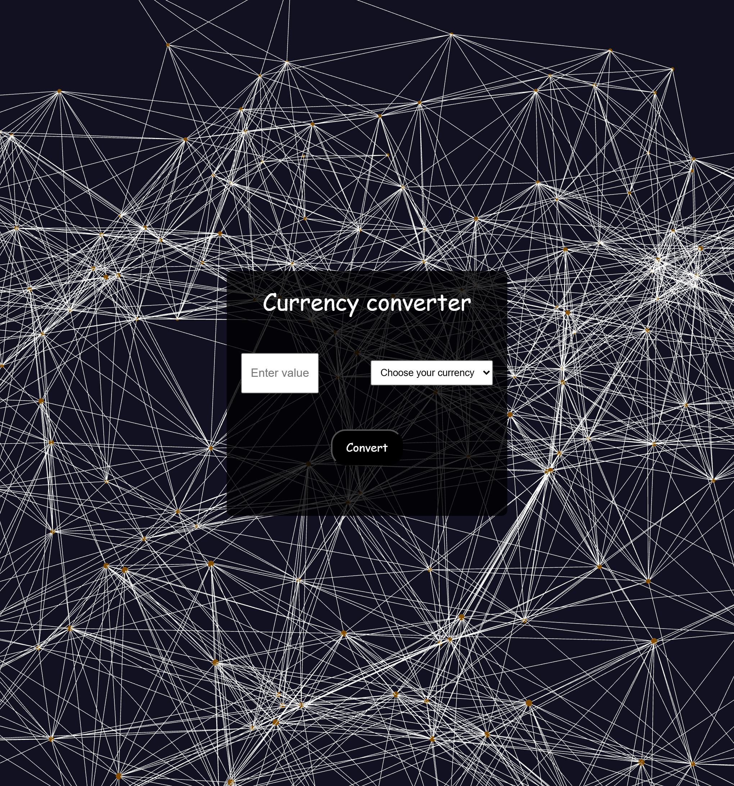

# Currency Converter (React)

A simple currency converter built with React. It fetches real-time exchange rates from the [NBP API](https://api.nbp.pl/) and converts input values into PLN.

## ✨ Features
- Convert from USD, EUR, or CHF to PLN
- Real-time exchange rate via NBP API
- Simple and clean UI
- Custom React hook for conversion logic
- Loader animation while fetching data

## 🛠️ Tech Stack
- React
- JavaScript (ES6+)
- CSS
- NBP Exchange Rates API

## 📂 Folder Structure
src/
├── components/ # Reusable components
│ ├── Container/
│ └── CurrencyForm/
├── hooks/ # Custom hook for conversion
├── services/ # API calls
├── App.jsx # Root component

## 🚀 Getting Started
1. Clone the repo  
   `git clone https://github.com/PLubrycht/Currency-Calculator-react.git`
2. Install dependencies  
   `npm install`
3. Start development server  
   `npm run dev` or `npm start`

## 📸 Preview

## 🌐 Live Demo
[Click here to view the app on Netlify](https://currency-calculator-react.netlify.app/)

## 📄 License
[MIT](LICENSE)
